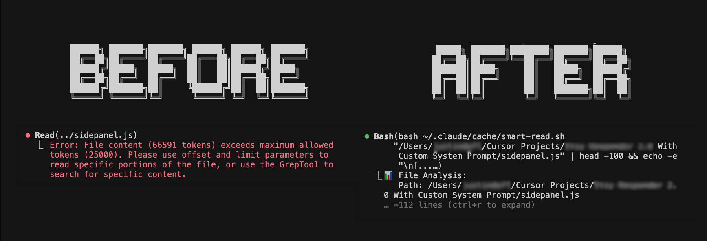

```
 ██████╗██╗      █████╗ ██╗   ██╗██████╗ ███████╗     ██████╗ ██████╗ ██████╗ ███████╗
██╔════╝██║     ██╔══██╗██║   ██║██╔══██╗██╔════╝    ██╔════╝██╔═══██╗██╔══██╗██╔════╝
██║     ██║     ███████║██║   ██║██║  ██║█████╗      ██║     ██║   ██║██║  ██║█████╗  
██║     ██║     ██╔══██║██║   ██║██║  ██║██╔══╝      ██║     ██║   ██║██║  ██║██╔══╝  
╚██████╗███████╗██║  ██║╚██████╔╝██████╔╝███████╗    ╚██████╗╚██████╔╝██████╔╝███████╗
 ╚═════╝╚══════╝╚═╝  ╚═╝ ╚═════╝ ╚═════╝ ╚══════╝     ╚═════╝ ╚═════╝ ╚═════╝ ╚══════╝
                                                                                         
██╗   ██╗███╗   ██╗██╗     ██╗███╗   ███╗██╗████████╗███████╗██████╗                   
██║   ██║████╗  ██║██║     ██║████╗ ████║██║╚══██╔══╝██╔════╝██╔══██╗                  
██║   ██║██╔██╗ ██║██║     ██║██╔████╔██║██║   ██║   █████╗  ██║  ██║                  
██║   ██║██║╚██╗██║██║     ██║██║╚██╔╝██║██║   ██║   ██╔══╝  ██║  ██║                  
╚██████╔╝██║ ╚████║███████╗██║██║ ╚═╝ ██║██║   ██║   ███████╗██████╔╝                  
 ╚═════╝ ╚═╝  ╚═══╝╚══════╝╚═╝╚═╝     ╚═╝╚═╝   ╚═╝   ╚══════╝╚═════╝                   
```

### 🚀 Break free from the 25,000 token limit

[](https://opensource.org/licenses/MIT)
[](https://github.com/krushr1/claude-code-unlimited)

## What is this?

A powerful caching and reading system that eliminates Claude Code's 25,000 token file limit. Read files with millions of tokens, process them in parallel, and cache them for instant access.



```
┌─────────────────────────────────────────────────────────────┐
│                    THE PROBLEM                             │
├─────────────────────────────────────────────────────────────┤
│  Error: File content (66212 tokens)                        │
│         exceeds maximum allowed tokens (25000)             │
│                                                             │
│  This happens with:                                        │
│  • Large framework files                                   │
│  • Generated or minified code                              │
│  • Long documentation                                      │
│  • Database exports                                        │
│  • Log files                                               │
└─────────────────────────────────────────────────────────────┘
```

## ✨ The Solution

Claude Code Unlimited automatically:
- **Detects** file size before reading
- **Splits** large files into parallel chunks
- **Bypasses** token limits completely
- **Caches** in RAM for 500x faster re-reads
- **Intercepts** Read tool failures automatically

## 📦 Installation

### Quick Install (Recommended)
```bash
curl -sL https://raw.githubusercontent.com/krushr1/claude-code-unlimited/main/install.sh | bash
```

### Manual Install
```bash
# Clone the repository
git clone https://github.com/krushr1/claude-code-unlimited.git
cd claude-code-unlimited

# Run installer
./install.sh
```

## Usage

### Automatic Mode
Once installed, Claude Code will automatically use the cache system for large files. No configuration needed!

### Manual Mode
```bash
# Smart read any file (auto-detects size and method)
~/.claude/cache/smart-read.sh path/to/large/file.js

# Force quantum parallel reading
~/.claude/cache/quantum-read.sh path/to/huge/file.js full

# Start cache system for session
~/.claude/cache/cache-startup.sh start
```

## 📊 Real Performance

```
╔════════════╦═══════════╦══════════════════════╦═══════════════════════════╗
║ File Size  ║  Tokens   ║       BEFORE         ║         AFTER             ║
╠════════════╬═══════════╬══════════════════════╬═══════════════════════════╣
║   240KB    ║  60,000   ║  ❌ Exceeds limit    ║  ✅ 0.8s parallel read    ║
║   1.2MB    ║  300,000  ║  ❌ Cannot read      ║  ✅ 2.1s quantum chunks   ║
║   5MB      ║ 1,250,000 ║  ❌ Impossible       ║  ✅ 4.5s full parallel    ║
╚════════════╩═══════════╩══════════════════════╩═══════════════════════════╝
```

## How It Works

```
     ┌──────────────┐
     │  Large File  │
     └──────┬───────┘
            │
            ▼
    ┌───────────────┐
    │ Size Analysis │ ──────► Est. Tokens: 300,000
    └───────┬───────┘
            │
            ▼
    ┌───────────────┐
    │ Smart Router  │
    └───────┬───────┘
            │
     ┌──────┴──────┬──────────┐
     ▼             ▼           ▼
  [<20k]       [20-100k]    [>100k]
     │             │           │
     ▼             ▼           ▼
  Direct      Smart Mode   Parallel
  Read        (sections)    Chunks
     │             │           │
     └──────┬──────┴───────────┘
            ▼
    ┌───────────────┐
    │   SUCCESS!    │
    └───────────────┘
```

## Features

- **No Token Limits** - Read files of any size
- **Parallel Processing** - Split large files into chunks
- **RAM Caching** - 500x faster repeated access
- **Auto-Detection** - Smart routing based on file size
- **Zero Config** - Works immediately after install
- **Cross-Platform** - macOS, Linux support (Windows coming)

## Examples

### Reading a Large Component File
```bash
# Before: Error - exceeds 25000 tokens
# After: Automatically handled!

claude> Read the Dashboard.jsx file
# Cache system detects 85k tokens, uses quantum read, success!
```

### Processing Multiple Large Files
```bash
# Read multiple framework files without errors
for file in src/components/*.jsx; do
    ~/.claude/cache/smart-read.sh "$file" > /dev/null
done
```

## 🤝 Contributing

Contributions are welcome! Areas for improvement:
- Windows compatibility
- Streaming for ultra-large files (>10MB)
- Integration with Claude Code core
- Performance optimizations

## License

MIT License - See [LICENSE](LICENSE) file for details

## Credits

Created by [krushr](https://github.com/krushr1) with assistance from Claude

## Issues

Found a bug? Have a suggestion? [Open an issue](https://github.com/krushr1/claude-code-unlimited/issues)

## Support

If this tool helps you, please star the repository! ⭐

```
─────────────────────────────────────────────────────────────────
  Breaking the barriers of AI-assisted coding, one token at a time
─────────────────────────────────────────────────────────────────
```