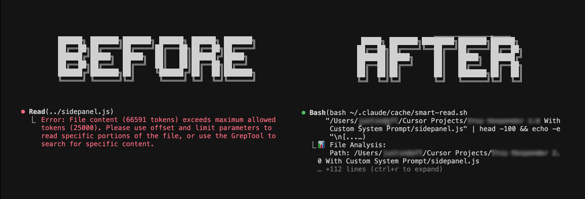

```
 ██████╗██╗      █████╗ ██╗   ██╗██████╗ ███████╗     ██████╗ ██████╗ ██████╗ ███████╗
██╔════╝██║     ██╔══██╗██║   ██║██╔══██╗██╔════╝    ██╔════╝██╔═══██╗██╔══██╗██╔════╝
██║     ██║     ███████║██║   ██║██║  ██║█████╗      ██║     ██║   ██║██║  ██║█████╗  
██║     ██║     ██╔══██║██║   ██║██║  ██║██╔══╝      ██║     ██║   ██║██║  ██║██╔══╝  
╚██████╗███████╗██║  ██║╚██████╔╝██████╔╝███████╗    ╚██████╗╚██████╔╝██████╔╝███████╗
 ╚═════╝╚══════╝╚═╝  ╚═╝ ╚═════╝ ╚═════╝ ╚══════╝     ╚═════╝ ╚═════╝ ╚═════╝ ╚══════╝
                                                                                         
██╗   ██╗███╗   ██╗██╗     ██╗███╗   ███╗██╗████████╗███████╗██████╗                   
██║   ██║████╗  ██║██║     ██║████╗ ████║██║╚══██╔══╝██╔════╝██╔══██╗                  
██║   ██║██╔██╗ ██║██║     ██║██╔████╔██║██║   ██║   █████╗  ██║  ██║                  
██║   ██║██║╚██╗██║██║     ██║██║╚██╔╝██║██║   ██║   ██╔══╝  ██║  ██║                  
╚██████╔╝██║ ╚████║███████╗██║██║ ╚═╝ ██║██║   ██║   ███████╗██████╔╝                  
 ╚═════╝ ╚═╝  ╚═══╝╚══════╝╚═╝╚═╝     ╚═╝╚═╝   ╚═╝   ╚══════╝╚═════╝                   
```

### v2: Built for the 1M token context window

[](https://opensource.org/licenses/MIT)
[](https://github.com/krushr1/claude-code-unlimited)

## What is this?

A project ingestion and caching system for Claude Code that takes full advantage of the 1M token context window.

**v1** worked around the 25k token Read limit by chunking and intercepting.  
**v2** flips the model: ingest your entire codebase once at session start, then never read again.



## The idea

```
OLD WAY (v1):  Read file → hit 25k limit → chunk → re-read → edit → re-read → edit
NEW WAY (v2):  Ingest everything → edit directly from context → done
```

Claude Opus and Sonnet now have 1M token context. That's enough to hold most codebases entirely in memory. CCU v2 ingests your project's source files with line numbers at session start, so Claude can edit directly without ever re-reading a file.

## How it works

1. **`ccu-ingest.sh`** runs at session start (via hook or manually)
2. It collects all git-tracked files, skipping binaries and vendor dirs
3. Extracts a symbol index (functions, classes, exports) with `file:line` refs
4. Scores files by git hotness — recently changed files load first
5. Outputs every file as `path:linenum: content` into a single context file
6. Stops at the 800k token budget, lists remaining files for manual access
7. Claude reads this once. Every file is now in context with line numbers.
8. Edits use `old_lines: "45-52"` — no re-reads needed.

### Architecture

```
Session Start
     │
     ▼
┌──────────────┐
│ ccu-ingest   │ ── git ls-files → filter → score by hotness
└──────┬───────┘
       │
       ▼
┌──────────────┐
│ Context File │ ── ~/.claude/cache/ccu-context.txt
│              │    path:1: first line
│              │    path:2: second line
│              │    ...up to 800k tokens
└──────┬───────┘
       │
       ▼
┌──────────────┐
│ Claude reads │ ── one Read call, entire project in context
│ once         │
└──────┬───────┘
       │
       ▼
┌──────────────┐
│ Edit with    │ ── old_lines: "45-52", new: "fixed code"
│ line numbers │    zero re-reads for the rest of the session
└──────────────┘
```

## Installation

### Quick Install
```bash
curl -sL https://raw.githubusercontent.com/krushr1/claude-code-unlimited/main/install.sh | bash
```

### Manual Install
```bash
git clone https://github.com/krushr1/claude-code-unlimited.git
cd claude-code-unlimited
./install.sh
```

### What gets installed

| File | Location | Purpose |
|------|----------|---------|
| `ccu-ingest.sh` | `~/.claude/cache/` | Full project ingestion with line numbers |
| `smart-read.sh` | `~/.claude/cache/` | Smart file reader (size-based routing) |
| `quantum-read.sh` | `~/.claude/cache/` | Parallel chunk reader for huge files |
| `cache-startup.sh` | `~/.claude/cache/` | RAM disk cache manager |
| `cache-live.sh` | `~/.claude/cache/` | Live-sync cache with file watching |
| `smart-read-interceptor.sh` | `~/.claude/hooks/` | Read tool hook (disabled in v2) |

## Configuration

### CLAUDE.md snippet

Add this to your project or global CLAUDE.md to activate the one-read-one-write workflow. See [CLAUDE.md](CLAUDE.md) for the full snippet.

```markdown
## CCU: One-Read-One-Write Protocol

At session start, CCU ingests the full project into context with line numbers.
After ingestion, every file is in your context as `path:linenum: content`.

Rules:
- DO NOT re-read files that were ingested. They are already in your context window.
- DO NOT use grep/search tools on the project. Search your context instead.
- EDIT DIRECTLY using the line numbers from ingestion (e.g., old_lines: "45-52").
- Files that were skipped (too large or over budget) can still be read normally.
- One read (at session start) + one write (per edit). No extra reads ever.
```

### Hooks setup

**Auto-ingest on session start** (recommended):
```json
{
  "hooks": {
    "SessionStart": [
      {
        "type": "command",
        "command": "~/.claude/cache/ccu-ingest.sh"
      }
    ]
  }
}
```

**Read interceptor** (disabled by default in v2, useful for smaller context models):
```json
{
  "hooks": {
    "PreToolUse": [
      {
        "matcher": "Read",
        "hooks": [
          {
            "type": "command",
            "command": "~/.claude/hooks/smart-read-interceptor.sh"
          }
        ]
      }
    ]
  }
}
```

### Environment variables

| Variable | Default | Description |
|----------|---------|-------------|
| `CCU_MAX_TOKENS` | `800000` | Total token budget for ingestion |
| `CCU_MAX_FILE_TOKENS` | `800000` | Per-file token limit |

Set lower values if you're on a smaller context model (e.g., `200000` for 200k context).

## Caching (optional)

The RAM disk cache is independent of ingestion. It pre-copies project files to a RAM volume for faster access by other tools.

```bash
# Create RAM disk and pre-cache project files
~/.claude/cache/cache-startup.sh start

# Or use live mode with file watching
~/.claude/cache/cache-live.sh start

# Check cache stats
~/.claude/cache/cache-startup.sh stats
```

Cache location: `/Volumes/ClaudeCache` (macOS). Created automatically, no sudo needed.

## v1 vs v2

| | v1 | v2 |
|---|---|---|
| **Problem** | 25k token Read limit | Wasted tool calls re-reading files |
| **Solution** | Chunk + intercept | Ingest everything once |
| **Context model** | Any | 1M token (Opus/Sonnet) |
| **Read interceptor** | Active (blocks large reads) | Disabled (no limit needed) |
| **Key file** | `smart-read.sh` | `ccu-ingest.sh` |
| **Workflow** | Read → chunk → read again → edit | Ingest → edit directly |

To use v1 behavior on smaller context models, remove `exit 0` from line 3 of `hooks/smart-read-interceptor.sh`.

## Requirements

### macOS
- `jq` for JSON processing: `brew install jq`
- `fswatch` for live cache mode: `brew install fswatch`
- `ripgrep` for fast search (optional): `brew install ripgrep`

### Linux
- `jq`: `apt install jq`
- `inotify-tools` for live mode: `apt install inotify-tools`
- `ripgrep` (optional): `apt install ripgrep`

## License

MIT License - See [LICENSE](LICENSE) file for details.

## Credits

Created by [krushr](https://github.com/krushr1) with Claude.
